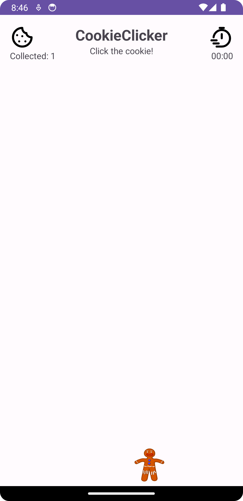
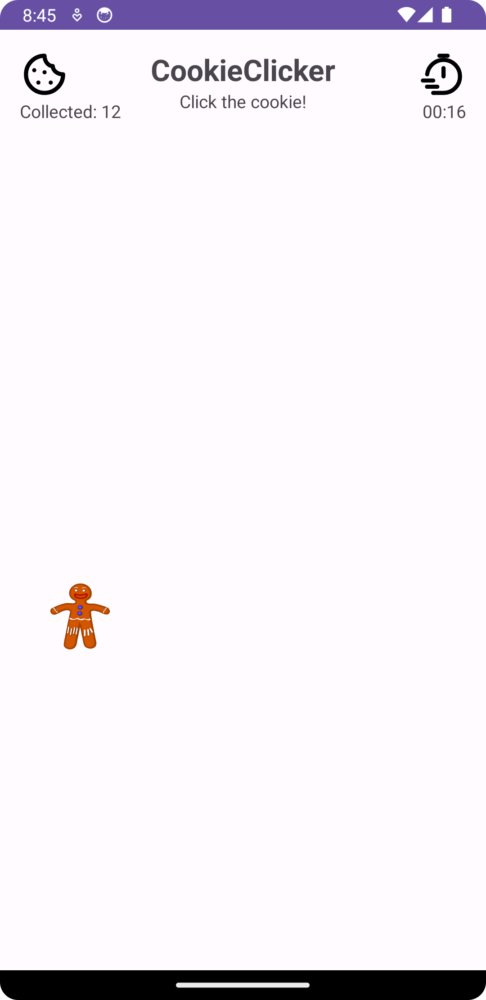

# Gingerbread Clicker
A simple cookieClicker done as a school project. 
- Hi! This is yet another simple app made for fun!
# Cookie Clicker App


## About
- This project is a simple Gingerbread clicker game developed as part of a school project. The app allows users to click on a cookie to collect them and keeps track of the total number of cookies collected and the elapsed time (still buggy).

## Future Improvements and Bug Fixes
- **Improved Design:** Enhance the app's user interface and design for a more appealing user experience.
- **Leaderboard:** Implement a leaderboard feature to compare your cookie collection statistics with other players.
- **Performance Optimization:** Optimize the app's performance for smoother gameplay.
- **Bug Fixes:** Address any known issues or bugs. .

## How to Play
- To play the Cookie Clicker App, follow these steps:

1. **Clone the Repository:**
   ```sh
   git clone https://github.com/yourusername/cookie-clicker.git
2. **Open in Android Studio:**
   - Build and compile the project
   - The app will be installed on an Android emulator or connected device.
3. **Start your device:**
   - Open the app on your emulated device
4. **Click the cookie!**


## License
This project is licensed under the [MIT License](LICENSE).

Thank you for checking out the Gingerbread CLicker App! Enjoy collecting cookies and have fun!

